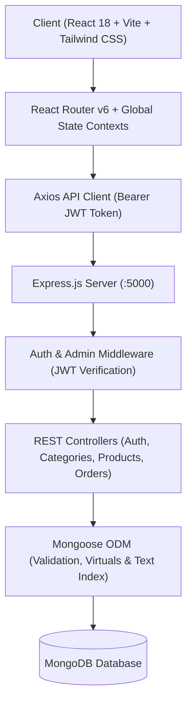

# Orient Computers & Engineering — Enterprise E-Commerce Platform

> **A Next-Generation Full-Stack MERN Computer Hardware E-Commerce & Retail Management System** built with **React 18, Vite, Tailwind CSS, Node.js, Express, MongoDB (Mongoose), and JSON Web Tokens**.

---

## 📌 Executive Summary

**Orient Computers & Engineering** is a full-featured, enterprise-grade e-commerce application engineered for the Bangladeshi computer retail and IT engineering market. The platform bridges high-performance computer hardware sales (flagship GPUs, CPUs, motherboards, creator laptops, and commercial networking infrastructure) with localized Bangladeshi commerce workflows, multi-channel payment simulations (bKash, Nagad, COD), interactive technical specification inspection, and complete executive back-office fulfillment.

---

## 🏗️ System Architecture



### Technology Stack
- **Frontend**: React 18, Vite 6, Tailwind CSS 3, Lucide React, Axios, Context API (Auth, Cart, Wishlist).
- **Backend**: Node.js, Express.js 4, Mongoose 8, JSONWebToken (JWT), Bcrypt.js, CORS, Morgan.
- **Database**: MongoDB with text indexes, virtual population, and schema-level validation.
- **Localization**: Bangladeshi Taka (`৳ BDT`), 8 Administrative Divisions & 64 Districts, bKash & Nagad mobile banking simulations.

---

## 🚀 Key Functional Modules

### 1. Amazon-Inspired Navigation & Header
- **Top Info Bar**: Motijheel showroom address, hotline (`+880 1711-000001`), official warranty badge, and order tracking link.
- **Universal Search Bar**: Multi-category dropdown with debounced live auto-suggest popup showing hardware thumbnails, stock status, and BDT prices.
- **Mega Menu Category Bar**: Flyout menus organizing CPUs, GPUs, Motherboards, Laptops, Monitors, and Networking.
- **Slide-out Cart Drawer**: Instant item adjustments, quantity steppers, and free delivery progress tracking.
- **Mobile Bottom Navigation**: 1-tap thumb navigation bar on mobile viewports.

### 2. Customer Storefront & Catalog
- **Hero Carousel Banner**: Auto-sliding promotional showcase highlighting RTX 4090, Intel 14th Gen, and OLED Gaming Laptops.
- **Department Exploration Grid**: Visual hardware category cards with active item counts.
- **Deal of the Day**: Flash sale section featuring a real-time ticking countdown clock (`Hours : Minutes : Seconds`).
- **Multi-Facet Catalog Filters**: Dynamic category tree, brand multi-select checkboxes, dual-range BDT price slider, in-stock toggle, star rating filter, and **Grid / List View Switcher**.

### 3. Comprehensive Product Details Page (PDP)
- **High-Res Gallery**: Interactive thumbnail switching and image zoom.
- **Pricing & Stock**: BDT formatted pricing, discount percentage badges, and live inventory status.
- **Technical Specification Table**: Detailed key-value hardware specifications (Socket, TDP, Form Factor, Clock Speeds, Memory, Interface, Architecture, Warranty).
- **Verified Customer Reviews**: Star rating distribution and authenticated review submission form.
- **"Frequently Bought Together"**: Compatible component recommendation grid.

### 4. Cart & Multi-Step Checkout Funnel
- **Dedicated Full Cart Page**: Quantity steppers, remove actions, and discount coupon code validator (`ORIENT10`, `ORIENT500`, `GAMING2026`).
- **Bangladeshi Administrative Locations**: Dropdown selector for all 8 divisions (*Dhaka, Chittagong, Sylhet, Rajshahi, Khulna, Barisal, Rangpur, Mymensingh*) and their corresponding districts.
- **Delivery Methods**: Standard Inside Dhaka (৳100, Free > ৳50,000), Outside Dhaka Courier (৳200), Express Same-Day (৳300), Showroom Pickup (Free).
- **Bangladeshi Payment Simulations**: Cash on Delivery (COD), bKash Mobile Banking (with TrxID verification), and Nagad Mobile Banking.
- **Order Confirmation & Printable Invoice**: Generates unique tracking numbers (`ORIENT-2026-XXXXXX`) with 1-click `window.print()` tax invoices.
- **Live Order Tracking**: 5-stage fulfillment pipeline (*Pending ➔ Confirmed ➔ Processing ➔ Shipped ➔ Delivered*) with activity timestamps.

### 5. Customer Account & Order History
- **My Orders**: Complete purchase history with status badges, delivery details, and direct invoice access.
- **Profile & Security**: Name, phone number, and password management.
- **Saved Addresses**: Default division, district, and street address for 1-click checkout.

### 6. Admin Management Console
- **Analytics KPI Cards**: Real-time metrics for Total Revenue (`৳`), Total Orders, Active SKUs, and Registered Customers.
- **Product Inventory Manager (CRUD)**: Searchable inventory table, "Add Product" modal with dynamic technical specifications builder, "Edit Product", and safe "Delete Product".
- **Order Fulfillment Pipeline Manager**: Master orders list with status filter pills and 1-click pipeline advancement controls.
- **Customer Directory**: Registered customer accounts directory.

---

## 🛠️ Local Installation & Setup

### Prerequisites
- Node.js (v18.0.0 or higher)
- MongoDB Server running locally on `mongodb://localhost:27017` (or MongoDB Atlas connection string)

### 1. Clone & Install Dependencies
```bash
# Clone the repository
git clone https://github.com/FahimShahriar2018/Orient-Computer-Engineering.git
cd Orient

# Install server dependencies
cd server
npm install

# Install client dependencies
cd ../client
npm install
cd ..
```

### 2. Environment Configuration
Create a `.env` file in the `server/` directory:
```env
PORT=5000
NODE_ENV=development
MONGO_URI=mongodb://localhost:27017/orient_computers
JWT_SECRET=orient_super_secure_jwt_secret_key_2026_internship_production
```

### 3. Seed Database with Authentic Hardware
```bash
npm --prefix server run seed
```

### 4. Run Full-Stack Development Servers
```bash
# Runs both Backend (port 5000) and Frontend (port 5173) concurrently
npm run dev
```

- Storefront: `http://localhost:5173`
- Backend API: `http://localhost:5000`

---

## 🔑 Test Credentials

| Role | Email | Password | Access Level |
| :--- | :--- | :--- | :--- |
| **Administrator** | `admin@orient.com.bd` | `orient123456` | Full Admin Dashboard, Inventory CRUD, Order Pipeline |
| **Customer** | `customer@orient.com.bd` | `orient123456` | Storefront, Wishlist, Checkout, My Orders |

*(1-Click demo login buttons are also available on the Login screen and Auth modal for instant access).*

---

## 📡 REST API Reference

### Authentication (`/api/auth`)
| Method | Endpoint | Description | Access |
| :--- | :--- | :--- | :--- |
| `POST` | `/api/auth/register` | Register new customer account | Public |
| `POST` | `/api/auth/login` | Authenticate user & return JWT | Public |
| `GET` | `/api/auth/me` | Fetch authenticated user session | Private |
| `PUT` | `/api/auth/profile` | Update profile, address & password | Private |
| `GET` | `/api/auth/users` | List all registered users | Admin |

### Hardware Products (`/api/products`)
| Method | Endpoint | Description | Access |
| :--- | :--- | :--- | :--- |
| `GET` | `/api/products` | Multi-facet filtered product catalog | Public |
| `GET` | `/api/products/featured`| Featured, Flash Deals & New Arrivals | Public |
| `GET` | `/api/products/filters` | Dynamic metadata (brands, categories, price range) | Public |
| `GET` | `/api/products/:idOrSlug`| Single product details with specs & reviews | Public |
| `POST` | `/api/products/:id/reviews`| Submit verified customer review | Private |
| `POST` | `/api/products` | Create new hardware SKU | Admin |
| `PUT` | `/api/products/:id` | Update existing hardware SKU | Admin |
| `DELETE`| `/api/products/:id` | Delete hardware SKU | Admin |

### Categories (`/api/categories`)
| Method | Endpoint | Description | Access |
| :--- | :--- | :--- | :--- |
| `GET` | `/api/categories` | Get category hierarchy tree | Public |
| `GET` | `/api/categories/:slug`| Get category by slug with subcategories | Public |

### Orders & Tracking (`/api/orders`)
| Method | Endpoint | Description | Access |
| :--- | :--- | :--- | :--- |
| `POST` | `/api/orders` | Place order & decrement inventory | Public / Private |
| `GET` | `/api/orders/my-orders` | Fetch authenticated customer orders | Private |
| `GET` | `/api/orders/track/:trackingNumber` | Public order lookup by Tracking Code | Public |
| `GET` | `/api/orders/analytics/overview` | Executive KPI revenue & order metrics | Admin |
| `GET` | `/api/orders` | List all orders with status filters | Admin |
| `GET` | `/api/orders/:id` | Fetch single order details | Private / Admin |
| `PUT` | `/api/orders/:id/status` | Update fulfillment pipeline status | Admin |

---

## 🏆 Software Engineering Highlights
- **Normalized Data Architecture**: Strict Mongoose schemas with virtuals for discount calculations and populated category references.
- **Defensive Error Handling**: Comprehensive async error wrapping with custom Express error middleware.
- **Client-Side Optimization**: Debounced search queries, memoized currency calculations, responsive image fallbacks, and persistent local storage synchronization.
- **Clean Code & Modularity**: Component-driven React architecture separated cleanly into contexts, pages, components, and services.

---

## 📄 License & Attribution
Developed for **Orient Computers & Engineering** internship demonstration by **Fahim Shahriar**. All product specifications and brand names (NVIDIA, Intel, AMD, ASUS, MSI, Gigabyte, MikroTik) are property of their respective manufacturers.
